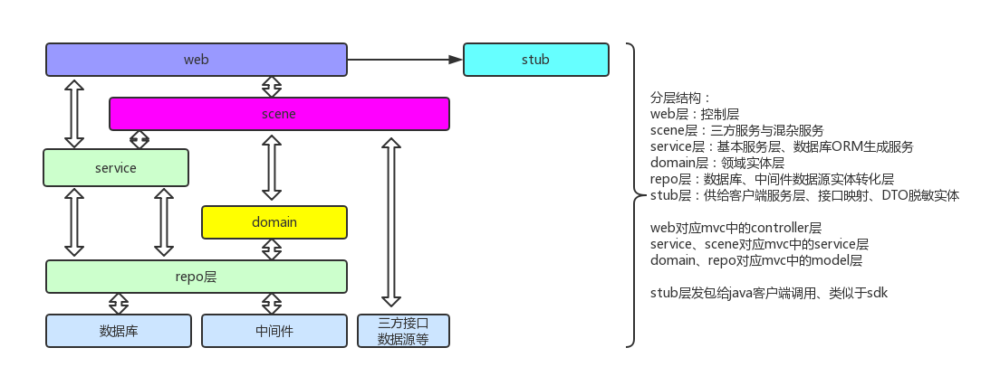

#### 多模块结构分层
* domain -领域实体层
* repo -数据源层
* scene -场景层(外部服务、混合复杂服务层)
* service -服务层
* stub -存根层(对外服务接口与实体)
* web -网站层(控制器、拦截器、过滤器等一切容器管理)

#### git分支规范
* master -主要稳定分支(生产版本)
* stage -主要集成分支(测试版本)
* develop -所有代码集中分支(开发版本,确保代码最全)
* feature-branches -特性开发分支(feature-英文描述,如feature-autocheck)
* release-branches -长期维护分支(release-版本号,如release-1.1.x)
* hotfix-branches -修复分支(修复分支-hotfix-修复人员名,如master-hotfix-jerryniu)

#### profile规范
* prod -生产配置
* test -测试配置
* dev -开发配置