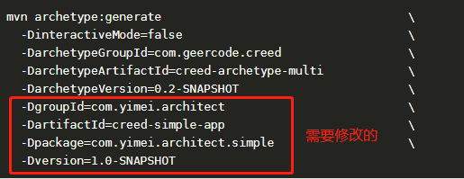

#### 1.设置镜像服务器(${user.dir}/.m2/settings.xml)
```
<settings>
  <mirrors>
     <mirror>
      <id>nexus</id>
      <mirrorOf>*</mirrorOf>
      <name>nexus</name>
      <url>http://svn.jufandev.com:8087/nexus/content/groups/public</url>
    </mirror>
  </mirrors>
</settings>
```
#### 2.执行脚本生成项目
```
mvn archetype:generate                                   \
  -DinteractiveMode=false                                \
  -DarchetypeGroupId=com.geercode.creed                  \
  -DarchetypeArtifactId=creed-archetype-multi            \
  -DarchetypeVersion=0.3-SNAPSHOT                        \
  -DgroupId=com.yimei.architect                          \
  -DartifactId=creed-simple-app                          \
  -Dpackage=com.yimei.architect.simple                   \
  -Dversion=1.0-SNAPSHOT
```

#### 3.执行测试代码生成orm
```
代码在repo层test中CreedOrmMpgTest.java
1.先修改resources/creed-mybatis-plus.properties中的配置
2.执行CreedOrmMpgTest.genAllTest()
```
